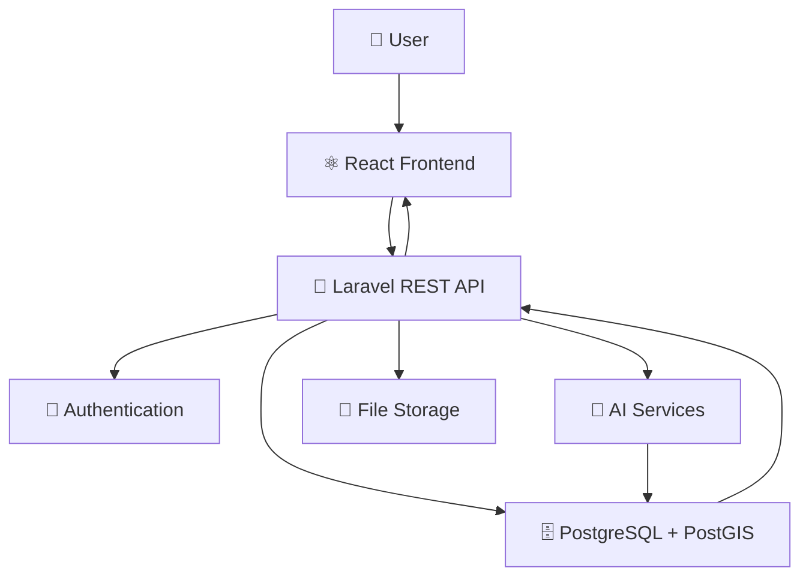

## 🏗️ System Architecture

```mermaid
graph TD

    USER["👤 User"]

    REACT["⚛️ React Frontend"]

    API["🚀 Laravel REST API"]

    AUTH["🔐 Authentication"]

    AI["🤖 AI Services"]

    DB["🗄️ PostgreSQL + PostGIS"]

    STORAGE["📁 File Storage"]

    USER --> REACT

    REACT --> API

    API --> AUTH

    API --> DB

    API --> AI

    API --> STORAGE

    AI --> DB

    DB --> API

    API --> REACT
```
