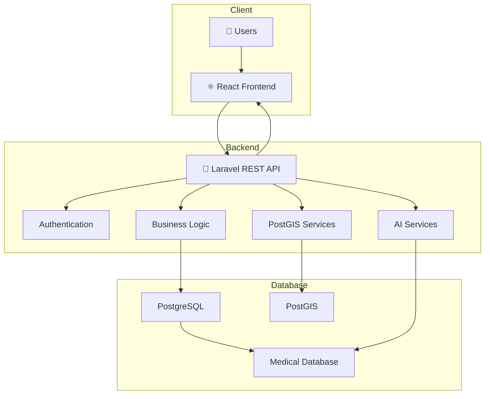
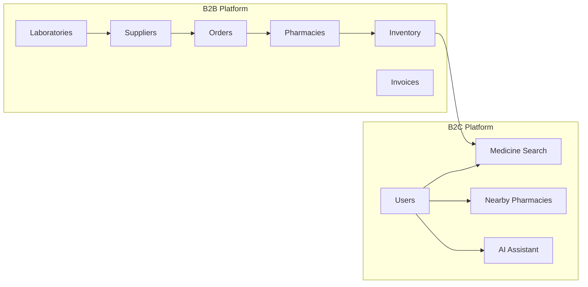
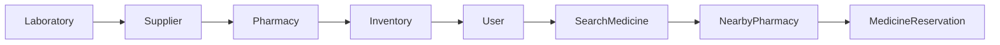
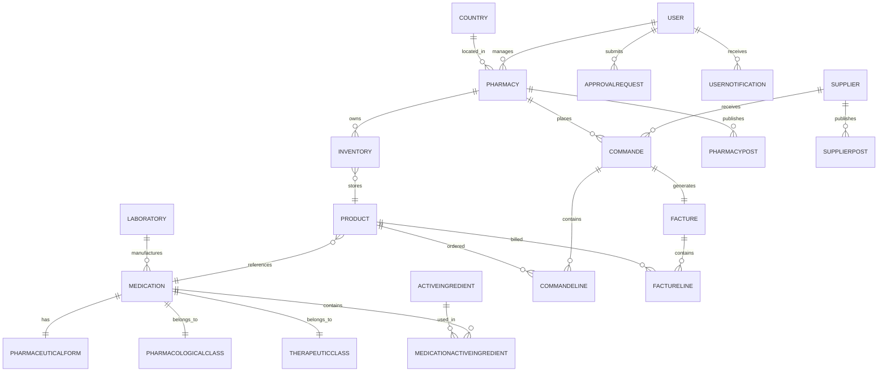

# 🩺 Dawadz – AI-Powered Pharmaceutical Supply & Distribution Platform

> A comprehensive digital platform that modernizes and secures the pharmaceutical supply chain by connecting laboratories, suppliers, pharmacies, and patients within a unified ecosystem.


---

# 📖 Overview

**Dawadz** is a full-stack digital healthcare platform designed to simplify and secure the distribution of medicines and medical supplies.

The platform bridges the gap between **laboratories, suppliers, pharmacies, and patients** by providing a unified solution for medicine procurement, inventory management, pharmacy discovery, and pharmaceutical information.

Built with modern web technologies and geospatial capabilities, Dawadz supports both **Business-to-Business (B2B)** operations and **Business-to-Consumer (B2C)** services through a scalable architecture.

---

# ✨ Features

## 🏢 Business Platform (B2B)

- Inventory management
- Purchase order management
- Supplier management
- Laboratory management
- Invoice generation
- Approval workflow
- Pharmaceutical catalog management
- Stock monitoring
- Notification system

## 👤 Public Platform (B2C)

- Medicine search
- Nearby pharmacy discovery
- Medicine availability
- AI-powered pharmaceutical assistant
- Medicine information
- Responsive user interface

---

# 🏗️ System Architecture



---

# 🌐 Platform Architecture

The platform is divided into two integrated ecosystems.



---

# 🔄 Medicine Supply Workflow



---

# 🗄️ Entity Relationship Diagram



---

# 🛠️ Technology Stack

| Layer | Technologies |
|--------|--------------|
| Frontend | React.js |
| Backend | Laravel |
| Database | PostgreSQL |
| Geospatial | PostGIS |
| Authentication | Laravel Authentication |
| APIs | RESTful API |
| AI | OpenAI API |

---

# 📂 Project Structure

```
dawadz
│
├── frontend
│   ├── components
│   ├── pages
│   ├── hooks
│   ├── services
│   └── assets
│
├── backend
│   ├── app
│   │   ├── Models
│   │   ├── Controllers
│   │   ├── Middleware
│   │   └── Services
│   ├── routes
│   ├── database
│   └── storage
│
└── README.md
```

---

# 🚀 Installation

### Clone the repository

```bash
git clone https://github.com/S1nju/dawadz.git

cd dawadz
```

### Backend

```bash
composer install

cp .env.example .env

php artisan key:generate

php artisan migrate

php artisan serve
```

### Frontend

```bash
cd frontend

npm install

npm run dev
```

---

# 💡 Example Use Cases

### 🏥 Pharmacies

- Manage inventory
- Order medicines
- Track invoices
- Monitor stock levels

### 🚚 Suppliers

- Receive pharmacy orders
- Publish product listings
- Manage deliveries

### 🧪 Laboratories

- Register medications
- Manage pharmaceutical products

### 👤 Patients

- Search medicines
- Find nearby pharmacies
- Check medicine availability
- Access AI-powered pharmaceutical assistance

---

# 🌍 Geospatial Features

Using **PostGIS**, Dawadz enables:

- Pharmacy location search
- Nearest pharmacy discovery
- Geographical medicine availability
- Efficient medicine distribution
- Location-aware pharmaceutical services

---

# 🔮 Future Roadmap

- Mobile application
- Online medicine reservations
- Real-time order tracking
- AI medicine recommendations
- Predictive inventory management
- Analytics dashboard
- Live notifications
- Multi-language support
- Docker deployment
- Kubernetes support

---

# 🏆 Hackathon Achievement

🥈 **2nd Place – Muhandis Hackathon**

Dawadz was developed during the **Muhandis Hackathon**, where it earned **Second Place** for its innovative approach to digitalizing the pharmaceutical supply chain using modern web technologies, geospatial databases, and artificial intelligence.

---

# 👥 Contributors

- **Anes Bouhaik**
- **Muhandis Hackathon Team**

---

# 📄 License

This project is licensed under the MIT License.
