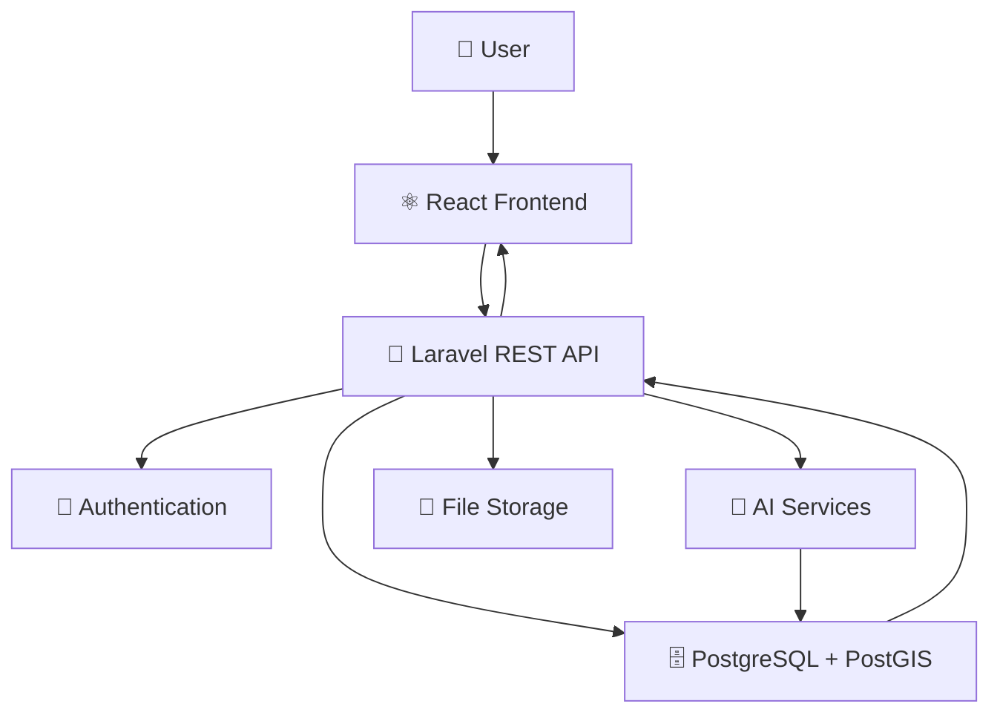
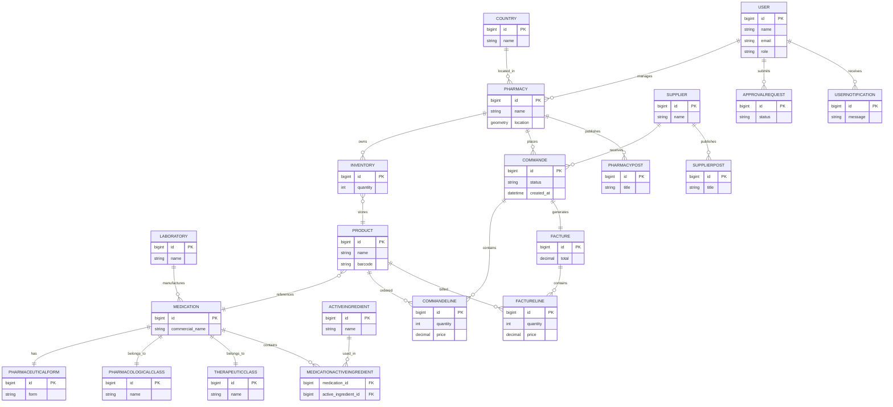

## 🏗️ System Architecture

```mermaid
graph TD

    USER["👤 User"]

    REACT["⚛️ React Frontend"]

    API["🚀 Laravel REST API"]

    AUTH["🔐 Authentication"]

    AI["🤖 AI Services"]

    DB["🗄️ PostgreSQL + PostGIS"]

    STORAGE["📁 File Storage"]

    USER --> REACT

    REACT --> API

    API --> AUTH

    API --> DB

    API --> AI

    API --> STORAGE

    AI --> DB

    DB --> API

    API --> REACT
```

## 🏗️ERD 

```mermaid
erDiagram

    USER {
        bigint id PK
        string name
        string email
        string role
    }

    PHARMACY {
        bigint id PK
        string name
        geometry location
    }

    LABORATORY {
        bigint id PK
        string name
    }

    SUPPLIER {
        bigint id PK
        string name
    }

    PRODUCT {
        bigint id PK
        string name
        string barcode
    }

    MEDICATION {
        bigint id PK
        string commercial_name
    }

    ACTIVEINGREDIENT {
        bigint id PK
        string name
    }

    MEDICATIONACTIVEINGREDIENT {
        bigint medication_id FK
        bigint active_ingredient_id FK
    }

    PHARMACEUTICALFORM {
        bigint id PK
        string form
    }

    PHARMACOLOGICALCLASS {
        bigint id PK
        string name
    }

    THERAPEUTICCLASS {
        bigint id PK
        string name
    }

    INVENTORY {
        bigint id PK
        int quantity
    }

    COMMANDE {
        bigint id PK
        string status
        datetime created_at
    }

    COMMANDELINE {
        bigint id PK
        int quantity
        decimal price
    }

    FACTURE {
        bigint id PK
        decimal total
    }

    FACTURELINE {
        bigint id PK
        int quantity
        decimal price
    }

    APPROVALREQUEST {
        bigint id PK
        string status
    }

    PHARMACYPOST {
        bigint id PK
        string title
    }

    SUPPLIERPOST {
        bigint id PK
        string title
    }

    COUNTRY {
        bigint id PK
        string name
    }

    USERNOTIFICATION {
        bigint id PK
        string message
    }

    COUNTRY ||--o{ PHARMACY : located_in

    USER ||--o{ PHARMACY : manages

    USER ||--o{ APPROVALREQUEST : submits

    USER ||--o{ USERNOTIFICATION : receives

    PHARMACY ||--o{ INVENTORY : owns

    INVENTORY }o--|| PRODUCT : stores

    PRODUCT }o--|| MEDICATION : references

    MEDICATION ||--|| PHARMACEUTICALFORM : has

    MEDICATION ||--|| PHARMACOLOGICALCLASS : belongs_to

    MEDICATION ||--|| THERAPEUTICCLASS : belongs_to

    MEDICATION ||--o{ MEDICATIONACTIVEINGREDIENT : contains

    ACTIVEINGREDIENT ||--o{ MEDICATIONACTIVEINGREDIENT : used_in

    SUPPLIER ||--o{ COMMANDE : receives

    PHARMACY ||--o{ COMMANDE : places

    COMMANDE ||--o{ COMMANDELINE : contains

    PRODUCT ||--o{ COMMANDELINE : ordered

    FACTURE ||--o{ FACTURELINE : contains

    PRODUCT ||--o{ FACTURELINE : billed

    COMMANDE ||--|| FACTURE : generates

    LABORATORY ||--o{ MEDICATION : manufactures

    PHARMACY ||--o{ PHARMACYPOST : publishes

    SUPPLIER ||--o{ SUPPLIERPOST : publishes
```
